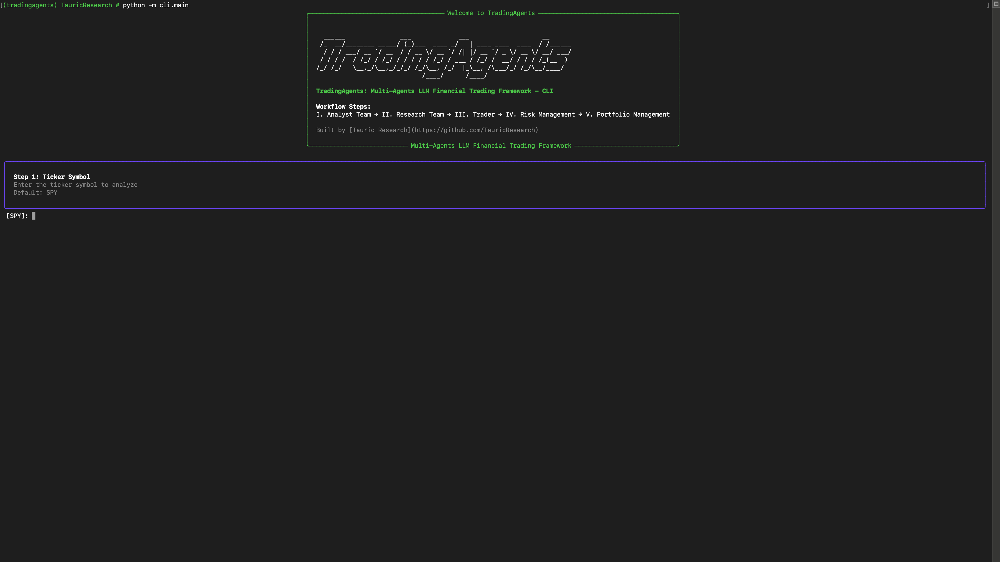
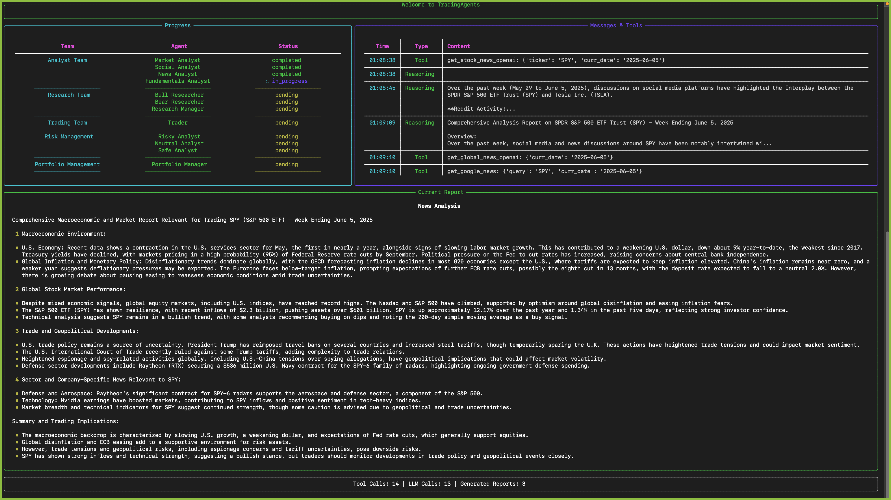

---

# Rich-Agents: 多智能体AI工具集

> 🎉 **Rich-Agents** 正式发布！基于TradingAgents成功架构，我们将其扩展为统一的多智能体AI工具集。
>
> Rich-Agents目前支持两个专业领域：**TradingAgent**（金融交易分析）和**PatentAgent**（专利智能体）。

<div align="center">
<a href="https://www.star-history.com/#TauricResearch/TradingAgents&Date">
 <picture>
   <source media="(prefers-color-scheme: dark)" srcset="https://api.star-history.com/svg?repos=TauricResearch/TradingAgents&type=Date&theme=dark" />
   <source media="(prefers-color-scheme: light)" srcset="https://api.star-history.com/svg?repos=TauricResearch/TradingAgents&type=Date" />
   
 </picture>
</a>
</div>

<div align="center">

🚀 [Rich-Agents](#rich-agents-框架) | ⚡ [安装使用](#installation-and-cli) | 🏦 [TradingAgent](#tradingagent-金融交易分析) | 🔬 [PatentAgent](#patentagent-专利智能体) | 🤝 [贡献](#contributing) | 📄 [引用](#citation)

</div>

## Rich-Agents 框架

Rich-Agents是一个统一的多智能体AI工具集，目前支持两个专业领域：

### 🏦 TradingAgent - 金融交易分析框架
基于真实交易公司的运作模式，通过专业的LLM驱动智能体协作：基本面分析师、情绪专家、技术分析师、交易员、风险管理团队等，共同评估市场条件并做出交易决策。这些智能体通过动态讨论来确定最优策略。

### 🔬 PatentAgent - 专利智能体系统  
将AI技术深度应用于知识产权领域，提供专利发现、验证、分析与撰写的完整解决方案。通过技术分析师、创新发现师、先行技术研究员、专利撰写员等智能体协作，实现从创新发现到专利申请的全流程自动化。

<p align="center">
  
</p>

> TradingAgents framework is designed for research purposes. Trading performance may vary based on many factors, including the chosen backbone language models, model temperature, trading periods, the quality of data, and other non-deterministic factors. [It is not intended as financial, investment, or trading advice.](https://tauric.ai/disclaimer/)

Our framework decomposes complex trading tasks into specialized roles. This ensures the system achieves a robust, scalable approach to market analysis and decision-making.

### Analyst Team
- Fundamentals Analyst: Evaluates company financials and performance metrics, identifying intrinsic values and potential red flags.
- Sentiment Analyst: Analyzes social media and public sentiment using sentiment scoring algorithms to gauge short-term market mood.
- News Analyst: Monitors global news and macroeconomic indicators, interpreting the impact of events on market conditions.
- Technical Analyst: Utilizes technical indicators (like MACD and RSI) to detect trading patterns and forecast price movements.

<p align="center">
  
</p>

### Researcher Team
- Comprises both bullish and bearish researchers who critically assess the insights provided by the Analyst Team. Through structured debates, they balance potential gains against inherent risks.

<p align="center">
  
</p>

### Trader Agent
- Composes reports from the analysts and researchers to make informed trading decisions. It determines the timing and magnitude of trades based on comprehensive market insights.

<p align="center">
  
</p>

### Risk Management and Portfolio Manager
- Continuously evaluates portfolio risk by assessing market volatility, liquidity, and other risk factors. The risk management team evaluates and adjusts trading strategies, providing assessment reports to the Portfolio Manager for final decision.
- The Portfolio Manager approves/rejects the transaction proposal. If approved, the order will be sent to the simulated exchange and executed.

<p align="center">
  
</p>

## 安装使用

### 安装

克隆Rich-Agents项目:
```bash
git clone https://github.com/TauricResearch/Rich-Agents.git
cd Rich-Agents
```

创建虚拟环境:
```bash
conda create -n rich-agents python=3.10+
conda activate rich-agents
```

安装基础依赖:
```bash
pip install -r requirements.txt
```

### 选择性安装

根据需要安装特定模块:

```bash
# 仅安装TradingAgent模块
pip install -e ".[trading]"

# 仅安装PatentAgent模块  
pip install -e ".[patent]"

# 安装中文市场支持
pip install -e ".[chinese]"

# 安装数据库支持
pip install -e ".[database]"

# 安装所有功能
pip install -e ".[all]"
```

### API配置

#### LLM提供商API密钥
```bash
# 百炼大模型 (推荐)
export DASHSCOPE_API_KEY=$YOUR_DASHSCOPE_API_KEY

# OpenAI
export OPENAI_API_KEY=$YOUR_OPENAI_API_KEY

# Google Gemini  
export GOOGLE_API_KEY=$YOUR_GOOGLE_API_KEY

# Anthropic Claude
export ANTHROPIC_API_KEY=$YOUR_ANTHROPIC_API_KEY
```

#### TradingAgent专用API
```bash
# 金融数据
export FINNHUB_API_KEY=$YOUR_FINNHUB_API_KEY
```

#### PatentAgent专用API
```bash
# Google Patents检索
export SERPAPI_API_KEY=$YOUR_SERPAPI_API_KEY

# 智慧芽专利数据
export ZHIHUIYA_CLIENT_ID=$YOUR_ZHIHUIYA_CLIENT_ID
export ZHIHUIYA_CLIENT_SECRET=$YOUR_ZHIHUIYA_CLIENT_SECRET
```

### 使用方法

#### Rich-Agents统一CLI
```bash
python main.py
```
或者
```bash
rich-agents
```

您将看到统一的选择界面，可以选择TradingAgent或PatentAgent。

#### 直接使用特定模块
```bash
# 直接启动TradingAgent
rich-agents --agent trading

# 直接启动PatentAgent  
rich-agents --agent patent

# 运行TradingAgent示例
python main.py --trading-example
```

#### 传统TradingAgent CLI
```bash
python -m cli.main
```

<p align="center">
  
</p>

An interface will appear showing results as they load, letting you track the agent's progress as it runs.

<p align="center">
  
</p>

<p align="center">
  
</p>

## TradingAgents Package

### Implementation Details

We built TradingAgents with LangGraph to ensure flexibility and modularity. We utilize `o1-preview` and `gpt-4o` as our deep thinking and fast thinking LLMs for our experiments. However, for testing purposes, we recommend you use `o4-mini` and `gpt-4.1-mini` to save on costs as our framework makes **lots of** API calls.

### Python Usage

To use TradingAgents inside your code, you can import the `tradingagents` module and initialize a `TradingAgentsGraph()` object. The `.propagate()` function will return a decision. You can run `main.py`, here's also a quick example:

```python
from tradingagents.graph.trading_graph import TradingAgentsGraph
from tradingagents.default_config import DEFAULT_CONFIG

ta = TradingAgentsGraph(debug=True, config=DEFAULT_CONFIG.copy())

# forward propagate
_, decision = ta.propagate("NVDA", "2024-05-10")
print(decision)
```

You can also adjust the default configuration to set your own choice of LLMs, debate rounds, etc.

```python
from tradingagents.graph.trading_graph import TradingAgentsGraph
from tradingagents.default_config import DEFAULT_CONFIG

# Create a custom config
config = DEFAULT_CONFIG.copy()
config["deep_think_llm"] = "gpt-4.1-nano"  # Use a different model
config["quick_think_llm"] = "gpt-4.1-nano"  # Use a different model
config["max_debate_rounds"] = 1  # Increase debate rounds
config["online_tools"] = True # Use online tools or cached data

# Initialize with custom config
ta = TradingAgentsGraph(debug=True, config=config)

# forward propagate
_, decision = ta.propagate("NVDA", "2024-05-10")
print(decision)
```

> For `online_tools`, we recommend enabling them for experimentation, as they provide access to real-time data. The agents' offline tools rely on cached data from our **Tauric TradingDB**, a curated dataset we use for backtesting. We're currently in the process of refining this dataset, and we plan to release it soon alongside our upcoming projects. Stay tuned!

You can view the full list of configurations in `tradingagents/default_config.py`.

## Contributing

We welcome contributions from the community! Whether it's fixing a bug, improving documentation, or suggesting a new feature, your input helps make this project better. If you are interested in this line of research, please consider joining our open-source financial AI research community [Tauric Research](https://tauric.ai/).

## Citation

Please reference our work if you find *TradingAgents* provides you with some help :)

```
@misc{xiao2025tradingagentsmultiagentsllmfinancial,
      title={TradingAgents: Multi-Agents LLM Financial Trading Framework}, 
      author={Yijia Xiao and Edward Sun and Di Luo and Wei Wang},
      year={2025},
      eprint={2412.20138},
      archivePrefix={arXiv},
      primaryClass={q-fin.TR},
      url={https://arxiv.org/abs/2412.20138}, 
}
```
